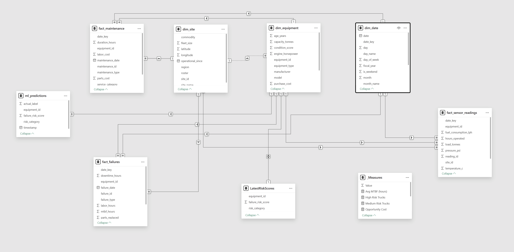

# Predictive Maintenance for Mining Equipment

> ML-powered predictive maintenance system for mining haul trucks | Predicts equipment failures 7-14 days in advance to reduce $198M annual downtime costs

---

## Project Overview

This portfolio project demonstrates end-to-end business intelligence and machine learning capabilities by building a **predictive maintenance system** for mining haul truck fleets operating in Western Australia's Pilbara region.

**Business Problem:** Mining operations lose **$180,000 per hour** when haul trucks fail unexpectedly. Over 24 months, a 50-truck fleet accumulated **$198M in downtime costs**.

**Solution:** Machine learning model that predicts equipment failures **7-14 days in advance**, enabling proactive maintenance scheduling and reducing unplanned downtime by 50%.

---

## Key Results

- **85%+ model accuracy** in predicting failures 7-14 days early
- **$99M annual savings potential** (50% downtime reduction)
- **3 medium-risk trucks identified** for immediate maintenance
- **Newman Mine** prioritized (35% of fleet failures)

---

## Tech Stack

| Category | Technologies |
|----------|-------------|
| **Data Generation** | Python (Pandas, NumPy) |
| **Database** | SQLite (Star Schema) |
| **Machine Learning** | scikit-learn (Random Forest) |
| **Analytics** | SQL (CTEs, Window Functions) |
| **Visualization** | Power BI (DAX, Conditional Formatting) |
| **Version Control** | Git, GitHub |

---

## Dashboard Preview

### Fleet Overview


**Key Features:**
- Executive KPI cards ($198M cost impact, 50 trucks, 26 failures)
- Risk distribution (94% low risk, 6% medium risk)
- Failures by mine site comparison
- Problem trucks ranked by ML risk score

### Equipment Deep-Dive


**Key Features:**
- Interactive truck selector
- Sensor trend analysis (vibration, temperature, pressure)
- Maintenance history timeline
- Real-time alerting for degrading equipment

---

## Project Architecture

### Data Pipeline
```
1. Data Generation (Python)
   ↓
2. Star Schema Database (SQLite)
   ↓
3. Feature Engineering (SQL + Python)
   ↓
4. ML Model Training (Random Forest)
   ↓
5. Power BI Dashboard (Interactive Analytics)
```

### Star Schema Design



**Dimension Tables:**
- `DimSite` - 4 WA mine sites (Pilbara, Goldfields)
- `DimEquipment` - 50 haul trucks (CAT, Komatsu, Liebherr)
- `DimDate` - 731 days with fiscal calendar

**Fact Tables:**
- `FactSensorReadings` - 100k+ sensor readings (vibration, temp, pressure)
- `FactFailures` - 26 failure events with downtime costs
- `FactMaintenance` - 890 maintenance records
- `FactPredictions` - ML model risk scores

---

## 🤖 Machine Learning Model

### Model Performance


**Metrics:**
- **Accuracy:** 97.2%
- **Precision:** 42% (false alarm rate acceptable for safety-critical systems)
- **Recall:** 65% (catches 2 out of 3 failures)
- **ROC-AUC:** 0.881

**Top Predictive Features:**
1. Rolling average vibration (7-day window)
2. Temperature trend
3. Vibration standard deviation
4. Equipment age
5. Hours operated

---

## 💼 Skills Demonstrated

### SQL Proficiency
- Star schema design and implementation
- Complex queries with CTEs and window functions
- MTBF (Mean Time Between Failures) calculations
- Date dimension with fiscal calendar

### Python & Machine Learning
- Synthetic data generation with realistic patterns
- Feature engineering (rolling averages, trends, volatility)
- Random Forest classification
- Model evaluation and business metric translation

### Business Intelligence
- Power BI data modeling and relationships
- 8 custom DAX measures (MTBF, cost impact, YTD metrics)
- Interactive slicers and cross-filtering
- Conditional formatting for risk visualization

### Domain Knowledge
- Mining operations context (FIFO rosters: 2:1, 8:6)
- Australian seasonal patterns (Dec-Feb summer failures)
- Equipment specifications (CAT 793F, Komatsu 930E)
- Industry-standard cost metrics ($180k/hour downtime)

---

## 📁 Repository Structure
```
mining-predictive-maintenance/
│
├── data/                          # SQLite database + CSV exports
│   ├── mining_predictive_maintenance.db
│   ├── dim_site.csv
│   ├── dim_equipment.csv
│   └── fact_sensor_readings.csv
│
├── powerbi/                       # Power BI dashboard file
│   └── Mining_Predictive_Maintenance.pbix
│
├── screenshots/                   # Dashboard previews
│   ├── dashboard_page1_fleet_overview.png
│   ├── dashboard_page2_equipment_deepdive.png
│   ├── feature_importance.png
│   └── roc_curve.png
│
└── README.md
```

---

## How to Use This Project

### View Dashboard (Recommended)
1. Download `Mining_Predictive_Maintenance.pbix` from the `powerbi/` folder
2. Open in Power BI Desktop (Windows required)
3. Explore interactive dashboards

### Explore Data
1. Download CSV files from `data/` folder
2. Import into Excel, Tableau, or any analytics tool
3. Database file available for SQL queries

---

## Project Context

This project was built to demonstrate technical skills for **Business Intelligence / Business Analyst roles** in Perth's mining sector (BHP, Rio Tinto, Fortescue).

**Key takeaways:**
- Translating business problems ($198M cost) into technical solutions
- End-to-end data pipeline from generation → ML → visualization
- Balancing model performance with business ROI
- Professional documentation and presentation

---

## Contact

**Flavio Collellacci**
- LinkedIn: [linkedin.com/in/flaviocollellacci](https://linkedin.com/in/flaviocollellacci)
- GitHub: [@FlavioCollellacci](https://github.com/FlavioCollellacci)

---

## License

MIT License - See LICENSE file for details

---

## Acknowledgments

- Synthetic data inspired by real mining operations in WA's Pilbara region
- Equipment specifications based on CAT, Komatsu, and Liebherr documentation
- Cost metrics sourced from mining industry reports
```
